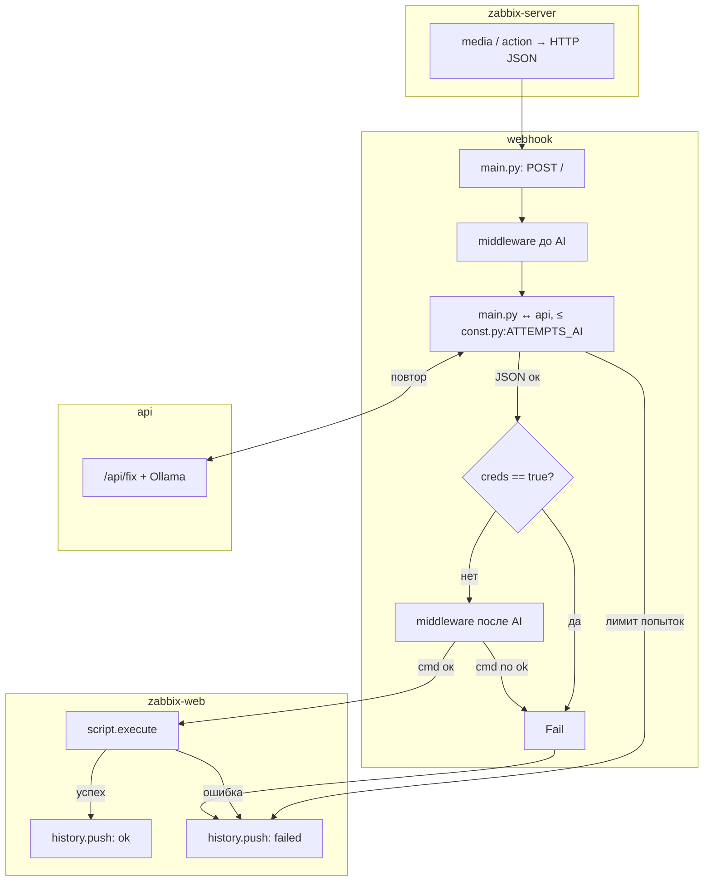

# Automated incident response system based on Zabbix

[](https://www.python.org/)
[](https://www.docker.com/)
[](https://alpinelinux.org/)
[](https://fastapi.tiangolo.com/)
[](https://nginx.org/)
[](https://ollama.com/)

## Running

```bash
docker compose up --build -d
```

## Net (zabbix_net 10.88.77.0/24)

| Сервис              | DNS (имя хоста)     | IPv4       | Порт  |
|---------------------|---------------------|------------|-------|
| Zabbix server       | zabbix-server       | 10.88.77.20| 10051 |
| Zabbix web          | zabbix-web          | (DHCP)     | 8080  |
| Agent (Debian)      | zabbix-agent-debian | 10.88.77.10| 10050 |
| Agent (Ubuntu)      | zabbix-agent-ubuntu | 10.88.77.11| 10050 |
| Agent (Rocky/Alma)  | zabbix-agent-rocky  | 10.88.77.12| 10050 |
| API                 | api                 |     DHCP     | 8443  |
| Webhook             | webhook             |     DHCP     | 9443  |
| PostgreSQL          | postgres            |     DHCP     | 5432  |

## Webhook pipeline target



## TODO

- [ ] middleware request/response AI
- [ ] Webhook/custom plugin по UNIX socket для получения ошибок с агентов Zabbix
- [ ] Лимит попыток к LLM: `webhook/const.py:ATTEMPTS_AI` (env `ATTEMPTS_AI`) и реализация цикла в `webhook/main.py` 
- [ ] Network middleware: валидация ip.src для webhook